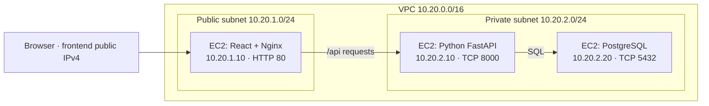

# Timestamp Notebook — three-tier EC2 lab

A React frontend, Python FastAPI backend, and PostgreSQL database for a DevOps internship lab. Enter text, select **Insert**, then select **Retrieve** to read the saved text and its server-generated timestamp.

## Start here

Read **[the beginner walkthrough](docs/BEGINNER-GUIDE.md)** in order. It includes Mac setup, GitHub publishing, AWS Console steps, deployment commands, troubleshooting, screenshots, and a live demonstration script.

Read **[the screenshot and demonstration checklist](docs/DEMO-CHECKLIST.md)** while you deploy. Take real AWS screenshots as you finish each checkpoint.

## Required AWS architecture



Exactly three EC2 instances. PostgreSQL runs directly on the database EC2 instance; there is no RDS. The two private instances have no public IPv4 addresses. Only the public subnet has a route to an Internet Gateway. Nginx forwards API requests so the browser never needs access to a private IP.

During installation only, Tinyproxy on the frontend lets the two private servers download packages. Stop it and remove its temporary security-group rules after installation. This does not require a NAT gateway, another EC2 instance, or a default route in the private subnet.

## What's included

| Folder/file | Purpose |
|---|---|
| `frontend/` | React app and production build configuration |
| `backend/` | Python API and pinned direct dependencies |
| `database/schema.sql` | Table and limited application permissions |
| `deploy/` | Numbered setup scripts for fresh Ubuntu 24.04 EC2 instances |
| `compose.yaml` | Optional full local rehearsal on your Mac |
| `docs/BEGINNER-GUIDE.md` | Complete deployment walkthrough |
| `docs/DEMO-CHECKLIST.md` | Evidence, demo order, and explanation for your team lead |
| `docs/VALIDATION.md` | Checks actually performed and remaining AWS verification |

## API

| Method | Path | Result |
|---|---|---|
| POST | `/api/entries` | Accepts `{"text":"Hello NETSOL"}`; returns ID, text and timestamp |
| GET | `/api/entries` | Latest 100 saved records, newest first |
| GET | `/api/entries?limit=10` | Latest 10 records; allowed limit 1–100 |
| GET | `/api/health` | Checks database/table access |

Text is trimmed and must contain 1–2000 characters. Python generates the UTC timestamp; PostgreSQL stores it as `TIMESTAMPTZ`. The UI displays your browser's local timezone and labels it. The application uses parameterized queries. It does not store notes in browser storage.

## Local rehearsal (optional)

With Docker and Compose available, copy `.env.example` to `.env`, replace the two placeholders with different passwords generated using `openssl rand -hex 32`, and run:

```bash
docker compose up --build -d
docker compose ps
```

Open **http://localhost:8080**. Only the frontend is published to your Mac. Stop the rehearsal with `docker compose down`; its database volume remains. See the guide before resetting data or changing database passwords.

For a UI-only preview with Node 24:

```bash
npm ci --prefix frontend
npm run dev --prefix frontend
```

Open the URL printed by Vite. Insert/retrieve require a backend at `127.0.0.1:8000`; use the Docker rehearsal above for the whole application.

## Scope

This is an educational, single-Availability-Zone HTTP lab with no login. Use made-up notes and restrict HTTP access to your and your evaluator's public IP addresses. A production service would need HTTPS, authentication, backups, and a resilience design. The guide includes cleanup to avoid leaving chargeable resources running.

The source is ready to publish to your GitHub account. No GitHub repository or AWS deployment is claimed by these files; perform those account steps in the guide.
